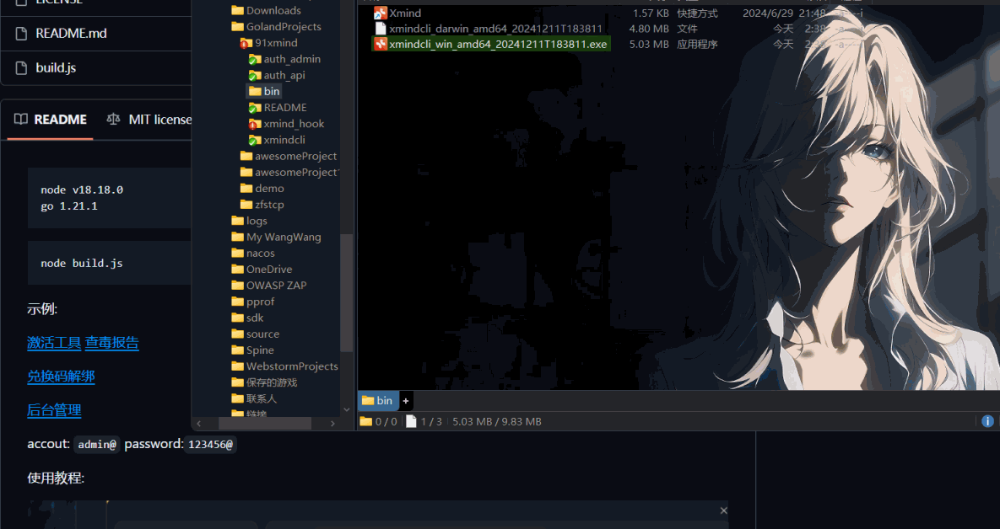

```
node v18.18.0
go 1.21.1 
```

```
node build.js
```

示例:

[激活工具](https://github.com/91xusir/91xmind/releases/tag/v1.0.0) [查毒报告](https://s.threatbook.com/report/file/08c4d2d9496b9429d2a14f3e99cf727f3acf9bb3d7070bbd8f21246ae9380965)

[兑换码解绑](https://xmind.aifake.xyz/ )

[后台管理](https://admin.xmind.aifake.xyz/ )

accout: `admin@`
password:`123456@`

使用教程:



------

私有部署说明:
auth_admin      授权码管理页面
auth_api           后端授权验证接口
xmind_hook     **$%^$
xmindcli            Patch Asar包用的命令行工具

部署脚本都写好了 node build.js 按顺序就行

1.用cfworker部署auth_api并自定义域名 

2.替换auth_admin/.env.production内的域名为上述域名

3.替换xmind_hook\src\config.js内的baseURL为上述域名

4.构建xmind_hook文件,编译后的文件保存在xmindcli/internal/crack/asset

5.编译xmindcli,会将上面的hook文件打包到可执行文件中,

运行就可以直接patch asar包了脚本会直接编译64位的windows和mac可执行文件,linux的我没写

6.构建xmind_admin部署到cfpage
